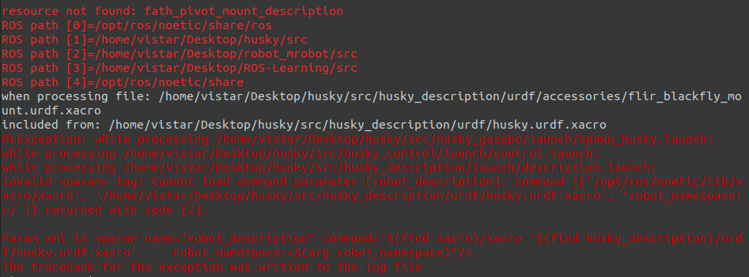
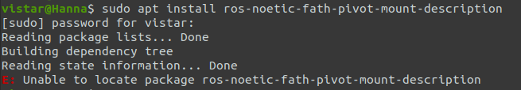

# [解决问题+方法论] ROS1配置husky仿真环境遇到的一些问题


# 一、问题描述

从github下载husky源码，加工作空间，编译，加环境变量，一顿操作后运行launch文件，结果一片红  -。-




# 二、问题分析

## 2.1 分析日志

在日志中，一般报错自顶向下是符合错误出现的先后顺序的，后出现的错误可能是由先出现的错误导致的，所以一般先分析最先出现的错误，对这个来说就是：

```bash
resource not found: fath_pivot_mount_description
ROS path [0]=/opt/ros/noetic/share/ros
ROS path [1]=/home/vistar/Desktop/husky/src
ROS path [2]=/home/vistar/Desktop/robot_mrobot/src
ROS path [3]=/home/vistar/Desktop/ROS-Learning/src
ROS path [4]=/opt/ros/noetic/share
```

第一句的意思是资源 `fath_pivot_mount_description` 没有找到，然后列出了搜索路径，这些都是我加入ROS环境变量的路径，其中包括`husky`，说明`husky`的环境变量配置成功了。

搜了一下这是一个ROS功能包，用于添加摄像机和其他传感器的手动可调 Fath 枢轴支架，[仓库路径](https://github.com/clearpathrobotics/fath_pivot_mount_description)。

而后面的报错：

```bash
RLException: while processing /home/vistar/Desktop/husky/src/husky_gazebo/launch/spawn_husky.launch:
while processing /home/vistar/Desktop/husky/src/husky_control/launch/control.launch:
while processing /home/vistar/Desktop/husky/src/husky_description/launch/description.launch:
Invalid <param> tag: Cannot load command parameter [robot_description]: command [['/opt/ros/noetic/lib/xacro/xacro', '/home/vistar/Desktop/husky/src/husky_description/urdf/husky.urdf.xacro', 'robot_namespace:=/']] returned with code [2]. 

Param xml is <param name="robot_description" command="$(find xacro)/xacro '$(find husky_description)/urdf/husky.urdf.xacro'     robot_namespace:=$(arg robot_namespace)"/>
The traceback for the exception was written to the log file
```

意思是说在处理 `description.launch` 文件时，命令 `'/opt/ros/noetic/lib/xacro/xacro', '/home/vistar/Desktop/husky/src/husky_description/urdf/husky.urdf.xacro', 'robot_namespace:=/'` 加载失败。看了一下 `husky.urdf.xacro` 文件确实依赖了 `fath_pivot_mount_description`，所以，要先解决 `fath_pivot_mount_description` 的问题。


## 2.2 尝试一（失败）

既然是找不到功能包，安装就行了，我的ROS版本是 noetic，安装对应功能包的指令如下：

```bash
sudo apt install ros-noetic-fath-pivot-mount-description
```

然而，人生不如意十之八九：



应该是ROS官方软件仓库没有包含该软件包。


## 2.3 尝试二（成功）

既然从官方库安装失败，那就直接源码安装，打开该软件包的 [github仓库](https://github.com/clearpathrobotics/fath_pivot_mount_description)，复制 git 路径：


点击绿色的 `Code` 然后复制路径，并 clone 源码到本地 husky 工作空间的 src 下，然后编译，如下指令：

```bash
# clone源码
git clone https://github.com/clearpathrobotics/fath_pivot_mount_description.git
# 编译
catkin_make
```

编译成功后，继续执行 husky 的 gazebo 启动文件，结果 -。-


这次是另一个软件包找不到，说明 `fath_pivot_mount_description` 的问题已经解决了，按照如上方法继续处理 `flir_camera_description` 的问题即可。


# 三、husky仿真需要安装的软件包

ROS1配置husky机器人仿真环境需要安装的软件包信息及说明如下：

```bash
# fath_pivot_mount_description，官方库没有，需要源码安装
git clone https://github.com/clearpathrobotics/fath_pivot_mount_description.git

# flir_camera_description，官方库没有，需要源码安装，注意安装分支要对应ROS版本
# 该仓库包括 flir_camera_description 和 spinnaker_camera_driver 两个软件包
# flir_camera_description 是相机模型，spinnaker_camera_driver 是相机驱动程序
# husky 仿真只用到了 flir_camera_description，如果你想保留spinnaker_camera_driver，需要额外安装 image_exposure_msgs 和 wfov_camera_msgs 两个消息软件包
# 仅对于 husky 仿真，下载 flir_camera_driver 后单独将 flir_camera_description 包放到husky/src下即可
git clone -b noetic-devel https://github.com/ros-drivers/flir_camera_driver.git

# lms1xx，官方库有，直接安装即可，注意对应ROS版本
sudo apt install ros-noetic-lms1xx
# 源码安装，注意对应ROS版本
# git clone -b noetic-devel https://github.com/clearpathrobotics/LMS1xx.git

# velodyne_description，官方库有，直接安装即可，注意对应ROS版本
sudo apt install ros-noetic-velodyne-description
# 源码安装
# git clone https://bitbucket.org/DataspeedInc/velodyne_simulator.git
```

至此，编译后，`roslaunch husky_gazebo empty_world.launch` 启动文件已经能启动gazebo并显示husky模型：


但启动过程中仍有一些报错：


这是 slam、手柄控制、键盘控制等功能的依赖包没有安装导致的加载失败，但不影响gazebo的启动与模型加载，如果需要仿真slam等功能，则需要安装他们，软件包信息及说明如下：

```bash
# robot_localization，官方库有，直接安装即可，注意对应ROS版本
sudo apt install ros-noetic-robot-localization
# 该软件包需要 geographic_msgs 消息软件包依赖，注意对应ROS版本
sudo apt install ros-noetic-geographic-msgs
# 该软件包需要 GeographicLib 库依赖
sudo apt install libgeographic-dev
# 源码安装，注意对应ROS版本
# git clone -b noetic-devel https://github.com/cra-ros-pkg/robot_localization.git

# interactive_marker_twist_server，官方库有，直接安装即可，注意对应ROS版本
sudo apt install ros-noetic-interactive-marker-twist-server
# 源码安装，ROS1对应版本在kinetic已稳定，ROS1 kinetic及以后都安装该版本
# git clone -b kinetic-devel https://github.com/ros-visualization/interactive_marker_twist_server.git

# twist_mux，官方库有，直接安装即可，注意对应ROS版本
sudo apt install ros-noetic-twist-mux
# 源码安装，注意对应ROS版本
# git clone -b noetic-devel https://github.com/ros-teleop/twist_mux.git

# joy，官方库有，直接安装即可，注意对应ROS版本
sudo apt install ros-noetic-joy
# 源码安装，下载后单独将 joy 包放到husky/src下
# git clone https://github.com/ros-drivers/joystick_drivers.git

# teleop_twist_joy，官方库有，直接安装即可，注意对应ROS版本
sudo apt install ros-noetic-teleop-twist-joy
# 源码安装，注意对应ROS版本
# git clone https://github.com/ros-teleop/teleop_twist_joy.git
```


# 四、总结 - 方法论

对这种 `xacro` 文件加载失败的问题，一般就几个原因：

## 4.1 文件路径不合法

检查xacro文件路径，使用`vim`等打开文件，能打开说明路径对的，如：

```bash
vim /home/vistar/Desktop/husky/src/husky_description/urdf/husky.urdf.xacro
```


## 4.2 文件内容不合法

检查xacro文件内容，使用xacro指令检查文件，如果命令成功运行，它应该输出生成的 URDF 文件内容。如果出现错误信息，根据错误提示修正 xacro 文件。

```bash
xacro /home/vistar/Desktop/husky/src/husky_description/urdf/husky.urdf.xacro robot_namespace:=/
```

如 xacro 未安装，使用如下命令安装：

```bash
sudo apt update
sudo apt install ros-noetic-xacro
```


## 4.3 ROS 环境变量

检查你的ROS工作空间路径是否加到环境变量中：

```bash
echo $ROS_PACKAGE_PATH
```

如不存在，有两种方法添加：

### 4.3.1 方法一

使用source指令，适合临时使用的工作空间：

```bash
source /opt/ros/noetic/setup.bash
source ~/Desktop/husky/devel/setup.bash
```

每次打开新终端，手动执行上述指令。


### 4.3.2 方法二

适合长期使用的工作空间。

将上述指令加到 `~/.bashrc` 中，每次新终端打开都会自动调用该脚本，不用手动执行。


